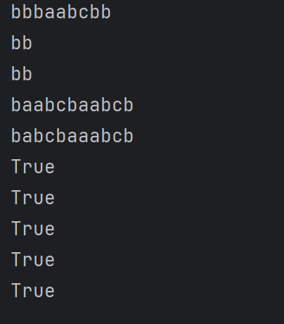
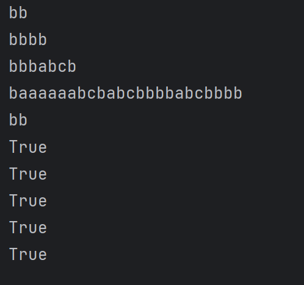

# Topic: Intro to formal languages. Regular grammars. Finite Automata.


### Course: Formal Languages & Finite Automata
### Author: Anastasia Țîganescu, FAF-231

----

## Theory
Regular grammars  are used to define rules for creating strings which
belong to a specific language. The rules are written as Production Rules
where a non-terminal symbol is replaced by either a terminal symbol or another non-terminal symbol. 
Regular grammars can be represented by finite automata, which are machines that can recognize
and accept strings from a language. They move between states using the input strings from the grammar they are based on.


## Objectives:

* Understand the concept of regular grammars and their representation.

* Implement a grammar that generates valid strings.

* Convert a grammar into a finite automaton.

* Validate string acceptance using the finite automaton.

# Implementation description

## Grammar Class
I implemented the following grammar from my variant, corresponding to number 29: 

```
Variant 29:
VN={S, A, B, C},
VT={a, b}, 
P={ 
    S → bA     
    A → b    
    A → aB   
    B → bC    
    C → cA
    A → bA
    B → aB
}
```
I realized that this grammar is regular because each production rule fits a specific form:

It either has a single terminal followed by a non-terminal (e.g., S → bA), or
it has a non-terminal that leads to either another non-terminal or a terminal (e.g., A → b, A → aB).
This type of structure is typical of right-linear or left-linear grammars, which are regular. I checked my grammar and saw that all production rules fit within these formats, confirming it is regular.
```
class Grammar:
    def __init__(self):
        self.V_n = ["S", "A", "B", "C"]
        self.V_t = ["a", "b", "c"]  #mistake, there was c missing
        self.P = {"S": ["bA"],
                  "A": ["b", "aB", "bA"],
                  "B":["bC", "aB"],
                  "C": ["cA"]}

```

The generate_string() method generates a random valid string starting from S, repeatedly replacing non-terminals with random production rules until only terminal symbols remain.

## Finite Automaton Class

I also implemented a Finite Automaton class from my grammar. 
The string_belongs_to_fa() method verifies whether a given string belongs to the language recognized by the automaton by simulating the transition process.

## Grammar to Finite Automaton Conversion
The to_finite_automaton() method converts a regular grammar into a finite automaton by:

* Mapping production rules to state transitions.

* Assigning final states dynamically based on grammar rules

## Results & Screenshots 
To test the grammar and finite automaton, I used the code in the main.py.
There, I generated 5 random valid strings using the generate_string() method. Then, I validated whether each string belongs to the language recognized by the finite automaton.





## Conclusions
* The implementation successfully generates valid strings based on the given regular grammar.
* The finite automaton correctly recognizes strings from the generated grammar.
* The conversion from grammar to finite automaton and the validation of strings works as expected.

## References
* [Converting Regular Grammar to Finite Automata ](https://www.youtube.com/watch?v=frzs_IWiiqQ)
* [Python Classes](https://realpython.com/python-classes/)
* [Regular Grammars](https://www.geeksforgeeks.org/regular-grammar-model-regular-grammars/)