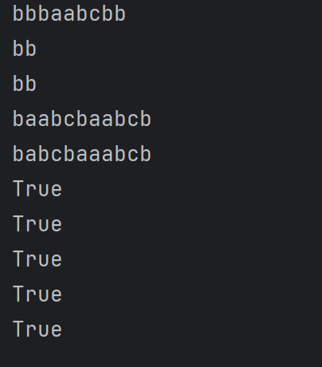
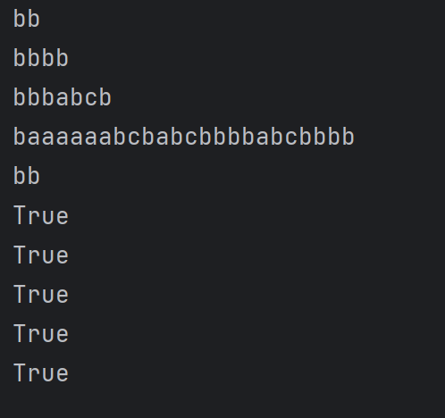

# Topic: Intro to formal languages. Regular grammars. Finite Automata.


### Course: Formal Languages & Finite Automata
### Author: Anastasia Țîganescu, FAF-231

----

## Theory
Regular grammars  are used to define rules for creating strings which
belong to a specific language. The rules are written as Production Rules
where a non-terminal symbol is replaced by either a terminal symbol or another non-terminal symbol. 
Regular grammars can be represented by finite automata, which are machines that can recognize
and accept strings from a language. They move between states using the input strings from the grammar they are based on.


## Objectives:

* Understand the concept of regular grammars and their representation.

* Implement a grammar that generates valid strings.

* Convert a grammar into a finite automaton.

* Validate string acceptance using the finite automaton.

# Implementation description

## Grammar Class
I implemented the following grammar from my variant, corresponding to number 29: 

```
Variant 29:
VN={S, A, B, C},
VT={a, b}, 
P={ 
    S → bA     
    A → b    
    A → aB   
    B → bC    
    C → cA
    A → bA
    B → aB
}
```
I realized that this grammar is regular because each production rule fits a specific form:

It either has a single terminal followed by a non-terminal (e.g., S → bA), or
it has a non-terminal that leads to either another non-terminal or a terminal (e.g., A → b, A → aB).
This type of structure is typical of right-linear or left-linear grammars, which are regular. I checked my grammar and saw that all production rules fit within these formats, confirming it is regular.
```
class Grammar:
    def __init__(self):
        self.V_n = ["S", "A", "B", "C"]
        self.V_t = ["a", "b", "c"]  #mistake, there was c missing
        self.P = {"S": ["bA"],
                  "A": ["b", "aB", "bA"],
                  "B":["bC", "aB"],
                  "C": ["cA"]}

```

The generate_string() method generates a random valid string starting from S, repeatedly replacing non-terminals with random production rules until only terminal symbols remain.

```
    def generate_string(self):
        start = "S"
        valid_string = start
        while any(symbol in self.V_n for symbol in valid_string):
            for i, symbol in enumerate(valid_string):
                if symbol in self.V_n:
                    symbol = random.choice(self.P[symbol])
                    valid_string = valid_string[:i] + symbol + valid_string[i+1:]
                    break
        return valid_string
```

The method starts with the initial symbol S. It repeatedly replaces non-terminals with 
corresponding production rules chosen randomly. The process stops when there are no non-terminals left, resulting in a valid string from the language.

## Finite Automaton Class

I also implemented a Finite Automaton class from my grammar. 

* __init__(): Initializes the finite automaton with:

  * q: The set of states (corresponding to non-terminals in the grammar).

  * sigma: The alphabet of the automaton (terminal symbols from the grammar).

  * delta: The transition function, which defines state changes based on input symbols.

  * q0: The initial state.

  * f: The set of final states.

* string_belongs_to_fa(string): Checks whether the given input string is accepted by the FA. The process is as follows:

```
    def string_belongs_to_fa(self, string):
        current_states = [self.q0]

        for char in string:
            next_states = []

            for state in current_states:
                if (state, char) in self.delta:
                    next_states.extend(self.delta[(state, char)])
                else:
                    return False

            current_states = next_states

        if any(state in self.f for state in current_states):
            return True
        else:
            return False
```

* The automaton starts in the initial state and reads each character of the string.

* It follows the corresponding transition to the next state.

* If, at the end of the string, the automaton is in a final state, the string is accepted.

* Otherwise, the string is rejected.

## Grammar to Finite Automaton Conversion
The to_finite_automaton() method converts a regular grammar into a finite automaton by:

* Mapping Production Rules to State Transitions:

    * Each rule of the form A → xB is translated into a transition from state A to state B on input x.

    * If a rule ends with a terminal (A → x), the state A is considered a final state.

* Building the Transition Function (delta):

    * The method iterates over each non-terminal and its production rules.

    * For each rule, it determines the terminal symbol and the next state.

    * It updates delta to reflect the transitions.

* Defining Final States Dynamically.

    * A state is marked as final if it has a rule that leads to only terminal symbols.
```
    def to_finite_automaton(self):
        delta = {}
        for non_terminal, productions in self.P.items():
            for production in productions:
                for i in range(len(production)):
                    if production[i] in self.V_t:
                        if (non_terminal, production[i]) not in delta:
                            delta[(non_terminal, production[i])] = []
                        next_state = None
                        for non_terminal2 in self.V_n:
                            if non_terminal2 in production:
                                next_state = non_terminal2
                                break
                        if next_state is None:
                            next_state = non_terminal
                            f = non_terminal
                        delta[(non_terminal, production[i])].append(next_state)

        finite_automaton = FiniteAutomaton(self.V_n, self.V_t,delta, "S", f)
        return finite_automaton
```

## Results & Screenshots 
To test the grammar and finite automaton, I used the code in the main.py.
There, I generated 5 random valid strings using the generate_string() method. Then, I validated whether each string belongs to the language recognized by the finite automaton.





## Conclusions
* The implementation successfully generates valid strings based on the given regular grammar.
* The finite automaton correctly recognizes strings from the generated grammar.
* The conversion from grammar to finite automaton and the validation of strings works as expected.

## References
* [Converting Regular Grammar to Finite Automata ](https://www.youtube.com/watch?v=frzs_IWiiqQ)
* [Python Classes](https://realpython.com/python-classes/)
* [Regular Grammars](https://www.geeksforgeeks.org/regular-grammar-model-regular-grammars/)