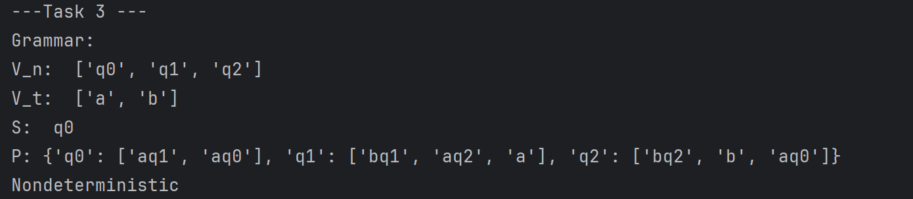
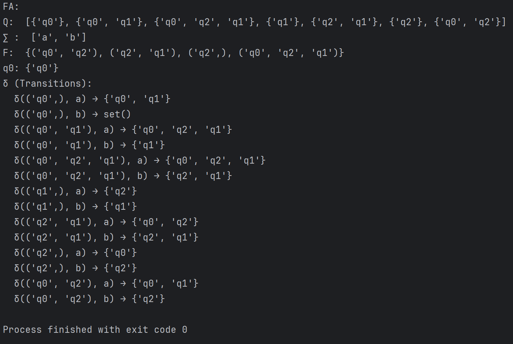

# Topic: Determinism in Finite Automata. Conversion from NDFA 2 DFA. Chomsky Hierarchy.


### Course: Formal Languages & Finite Automata
### Author: Anastasia Țîganescu, FAF-231

----

## Theory
In computer science, automata are mathematical models used to represent machines that recognize patterns or process inputs in a specific way. They are fundamental in understanding how computers process languages. One of the simplest types of automata is the finite automaton, which can be deterministic (DFA) or non-deterministic (NDFA). These automata are used to recognize regular languages, which are types of languages that can be described using a regular expression.
## Objectives:

* Understand what an automaton is and what it can be used for.
* Continuing the work in the same repository and the same project, the following need to be added: 
  * Provide a function in your grammar type/class that could classify the grammar based on Chomsky hierarchy.
  * For this you can use the variant from the previous lab.
  
* According to your variant number (by universal convention it is register ID), get the finite automaton definition and do the following tasks:
  * Implement conversion of a finite automaton to a regular grammar.
  * Determine whether your FA is deterministic or non-deterministic.
  * Implement some functionality that would convert an NDFA to a DFA.
  * Represent the finite automaton graphically (Optional, and can be considered as a bonus point):
    * You can use external libraries, tools or APIs to generate the figures/diagrams.
    * Your program needs to gather and send the data about the automaton and the lib/tool/API return the visual representation.

# Implementation description

## Task 2: Provide a function in your grammar type/class that could classify the grammar based on Chomsky hierarchy.
I wrote the function `classify_by_chomsky(grammar)` which, in my main.py file classifies only my grammar from the previous lab:

```
Variant 29:
VN={S, A, B, C},
VT={a, b}, 
P={ 
    S → bA     
    A → b    
    A → aB   
    B → bC    
    C → cA
    A → bA
    B → aB
}
```

The function classifies any grammar given in a specific format. So, I also applied unit testing to test the classification on other grammars
given as variants.

It takes a grammar object as input (likely an instance of a Grammar class), which contains production rules (P). It classifies the grammar into one of the Chomsky types based on regular expressions and checks on the production rules.
First, I defined the  regular expressions for each grammar type:

```
def classify_by_chomsky(grammar):

    type3 = {"left":'[A-Z]{1}', "right":['[A-Z]?[a-z]*', '[a-z]*[A-Z]?']}
    type2 = r'^[^\s]*[A-Z]*[^\s]*$'
    type1 = {"left":'[a-z]*[A-Z]+[a-z]*', "right":'[a-zA-Z]*'} #lenght of left and right matters??
```
* Type 3 (Regular Grammar):
  * The left side of the production is a single uppercase letter [A-Z]{1} (a non-terminal).
  * The right side of the production can have two forms:
    * Either an optional uppercase letter followed by zero or more lowercase letters ([A-Z]?[a-z]*).
    * Or zero or more lowercase letters followed by an optional uppercase letter ([a-z]*[A-Z]?).


* Type 2 (Context-Free Grammar):
  * A general regular expression ^[^\s]*[A-Z]*[^\s]*$ is used to match the rule format.

* Type 1 (Context-Sensitive Grammar):
  * The left side must contain an uppercase letter preceded and followed by 0 or more lowercase letters ([a-z]*[A-Z]+[a-z]*)
  * The right side is a mix of lowercase and uppercase letters ([a-zA-Z]*), meaning it can contain both non-terminals and terminals.


```

    if all(re.fullmatch(type3["left"], left) for left in grammar.P.keys()):
        if all(re.fullmatch(type3["right"][0], rule) for rules in grammar.P.values() for rule in rules):
            return 3
        elif all(re.fullmatch(type3["right"][1], rule) for rules in grammar.P.values() for rule in rules):
            return 3
        elif all(re.fullmatch(type2, rule) for rules in grammar.P.values() for rule in rules):
            return 2
        else:
            return -1
    elif all(re.fullmatch(type1["left"],left) for left in grammar.P.keys()):
        if all(re.fullmatch(type1["right"], rule) for rules in grammar.P.values() for rule in rules):
            if all(len(left) <= len(rule) for left, right in grammar.P.items() for rule in right):
                return 1
            else:
                return 0
```
The function uses `re.fullmatch` to check whether all left-hand sides of the production rules match the regular expression for regular grammars .
Then, it checks if all right-hand sides of the production rules match either of the two possible forms for a regular grammar .
If all conditions are satisfied, it returns Type 3.

If the grammar doesn't match Type 3, the function checks if all right-hand sides of the production rules match the regular expression for Type 2 (type2).
If it does, the function returns Type 2.


If it doesn't match Type 2 either, the function checks if all left-hand sides of the production rules match the regular expression for Type 1 .
If the left-hand side matches, it checks whether all right-hand sides match the Type 1 pattern.
Then, it verifies whether the length of the left-hand side of the production rule is less than or equal to the length of the right-hand side for every production.
If all these conditions hold, it returns Type 1.
Return Type 0 (Unrestricted Grammar) if None of the Above Match:

If none of the above conditions hold (i.e., the grammar doesn't fit into Type 1, 2, or 3), it returns Type 0 (Unrestricted grammar).


## Task 3.1: Implement conversion of a finite automaton to a regular grammar.
For the entire task 3, I created the class `FiniteAutomaton` which has the following functions:
- **`fa_to_grammar(self)`**:
- **`is_nfa(self):`**:
- **`nfa_to_dfa(self):`**:

I wrote the function `fa_to_grammar(self)` which converts any finite automata given in a specific format, to a regular grammar:

```
    def fa_to_grammar(self):
        V_n = self.q
        V_t = self.sigma
        S = self.q0
        P = {}

        for state in self.q:
            P[state] = []

        for (start,char), result in self.delta.items():
            for next_state in result:
                P[start].append(f"{char}{next_state}")

                if next_state in self.f:
                    P[start].append(f"{char}")
        grammar = Grammar(V_n, V_t, S, P)
        return grammar
```

- **V_n**: Represents the set of non-terminal symbols, which are the states of the finite automaton (`self.q`).
- **V_t**: Represents the set of terminal symbols, which are the alphabet symbols of the automaton (`self.sigma`).
- **S**: The starting symbol, which is the initial state of the automaton (`self.q0`).
- **P**: A dictionary that holds the production rules, where each key is a state, and the value is a list of rules (strings) for that state.

### Key Steps:
1. **Initialization**: Creates an empty dictionary `P` where each state in the automaton gets an empty list of production rules.
2. **Filling Production Rules**:
   - It loops over each transition (`start`, `char`) and its resulting states (`result`) in `self.delta`.
   - For each transition, it generates a production rule of the form `"char + next_state"`, where `char` is the symbol from the alphabet and `next_state` is the state it transitions to.
   - If the `next_state` is a final state (i.e., it belongs to `self.f`), it adds an additional production rule with just `"char"`, signaling that this is a terminal symbol for that state.
3. **Return Grammar**: Finally, it creates and returns a `Grammar` object using the non-terminals `V_n`, terminals `V_t`, the start state `S`, and the production rules `P`.


## Task 3.2: Determine whether your FA is deterministic or non-deterministic.
For this subtask, I implemented `is_nfa(self):`

```
    def is_nfa(self):
        for (start, char), result in self.delta.items():
            if len(result) > 1:
                return True
        return False
```

This function checks if the finite automaton (FA) is a Non-deterministic Finite Automaton (NFA). It does this by looking for any state transition that has more than one possible next state (i.e., multiple transitions for the same state and input symbol). If such transitions are found, the automaton is an NFA. If none are found, the automaton is a DFA (Deterministic Finite Automaton).

## Task 3.3: Implement some functionality that would convert an NDFA to a DFA.
For this subtask, I implemented `nfa_to_dfa(self):`


1. **Initialization:**
   - `dfa_q0` is initialized with the initial state of the NFA, wrapped in a set.
   - `dfa_sigma` is the alphabet of the DFA, which is the same as the NFA's alphabet.
   - `dfa_delta` is an empty dictionary to store the transition function for the DFA.
   - `dfa_f` is an empty set to store the final states of the DFA.
   - `dfa_q` holds all the states of the DFA, initially containing just the initial state.
   - `unprocessed_states` is a list that holds states that still need to be processed.
   
```
      def nfa_to_dfa(self):
        dfa_q0 = {self.q0}
        dfa_sigma = self.sigma
        dfa_delta = {}
        dfa_f = set() #done
        dfa_q = [dfa_q0] #done
        unprocessed_states = [dfa_q0]
```

2. **State Processing:**
   - The function enters a loop that processes all unprocessed states.
   - For each state, it checks all possible input symbols (letters from `dfa_sigma`).
   - For each input symbol, it collects the next possible states by looking up the NFA’s transitions for the current states.
   - If new states are found (which aren’t already in `dfa_q`), they are added to `unprocessed_states` and `dfa_q`.

3. **Creating Transitions:**
   - The transition from a set of NFA states to another set is recorded in `dfa_delta` using a tuple representation of the states.


```
      while unprocessed_states:
            current = unprocessed_states.pop(0)

            for letter in dfa_sigma:
                next = set()

                for state in current:
                    if (state, letter) in self.delta:
                        next.update(self.delta[(state, letter)])
                if next and next not in dfa_q:
                    unprocessed_states.append(next)
                    dfa_q.append(next)
                dfa_delta[(tuple(current), letter)] = next
```


4. **Identifying Final States:**
   - For each DFA state, if any of its NFA states are final, the DFA state is considered a final state and added to `dfa_f`.

5. **Returning the DFA:**
   - Finally, a new `FiniteAutomaton` object is created for the DFA with the collected states, alphabet, transition function, initial state, and final states.
   - The DFA object is returned.


```
        for q in dfa_q:
            for state in q:
                if state in self.f:
                    dfa_f.add(tuple(q))

        dfa = FiniteAutomaton(dfa_q, dfa_sigma, dfa_delta,dfa_q0, dfa_f)
        return dfa
```

## Helper functions
I also implemented functions to nicely print the contents of the Grammar and the FA:

```
        def printGrammar(self):
        print("V_n: ",self.V_n)
        print("V_t: ",self.V_t )
        print("S: ",self.S)
        print("P:",self.P)
```

```
          def print_fa(self):
        print("Q: ", self.q)
        print("∑ : ", self.sigma)
        print("F: ", self.f)
        print("q0:", self.q0)
        print("δ (Transitions):")
        for (start, char), results in self.delta.items():
            print(f"  δ({start}, {char}) → {results}")  # Prints each transition on a new line

```


## Results & Screenshots

For task 2, I got the result that my grammar was of type 3, which was true indeed.


For task 3, it was printed: my resulting grammar from my FA, the type of my FA, and the DFA obtained from the NFA.





## Conclusions
In this lab, I deepened my understanding of formal languages and finite automata, specifically focusing on the conversion from NDFA to DFA and exploring the Chomsky hierarchy.
* I learned that finite automata are computational models that recognize and accept strings belonging to a specific language, which can be represented by regular grammars. The relationship between regular grammars and finite automata is fundamental to understanding how different computational models can represent the same language.
* A key takeaway from this lab was the application of the Chomsky hierarchy for classifying grammars. I became more familiar with the distinctions between Regular Grammars (Type 3), Context-Free Grammars (Type 2), and Context-Sensitive Grammars (Type 1). Understanding the hierarchy allowed me to analyze grammars and identify their type based on the production rules, an essential skill for working with formal languages.
* One significant lesson from this lab was recognizing the difference between deterministic finite automata (DFA) and non-deterministic finite automata (NDFA). I learned how to identify whether a finite automaton is deterministic or non-deterministic by examining its transitions. Understanding this distinction is critical because deterministic automata have a single unique state for each input, while non-deterministic automata may have multiple possible transitions for a single input.
Overall, I learned how to implement algorithms that perform these conversions and classifications, which are essential techniques in automata theory. This lab helped reinforce the theoretical concepts with hands-on experience, giving me a better understanding of how automata operate and how grammars can be used to define languages.

## References
* [Converting Finite Automata to Regular Grammar](hhttps://www.youtube.com/watch?v=9uY4KRfZsnM&t=117s)
* [Converting NFA to DFA](https://www.geeksforgeeks.org/conversion-from-nfa-to-dfa/)
