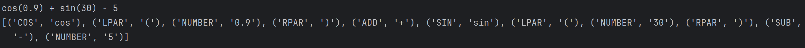
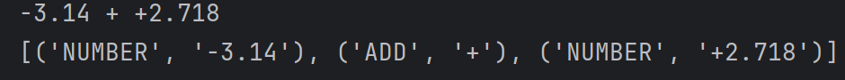
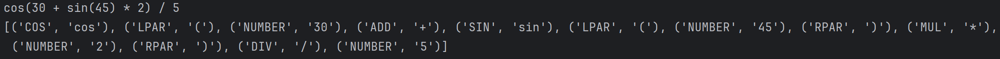

# Topic: Lexer & Scanner


### Course: Formal Languages & Finite Automata
### Author: Anastasia Țîganescu, FAF-231

----

# Theory
A lexer, also called a scanner or tokenizer, is the first
step in processing a programming language or mathematical 
expression. Its job is to scan an input string and break it down into smaller,
meaningful units called tokens. These tokens are then used by the next stage, usually a parser, 
to understand the structure of the expression or program.

A lexer does not check for syntax errors like missing parentheses—it simply converts text into tokens. 
The parser (next stage) is responsible for ensuring the tokens are arranged correctly.
# Objectives:

* Understand what lexical analysis [1] is.
* Get familiar with the inner workings of a lexer/scanner/tokenizer.
* Implement a sample lexer and show how it works.

# Implementation description

## 1. Token Definition
At the core of my lexer is the TOKENS dictionary, which defines different types of tokens and their corresponding regular expressions. These include:

* Numbers (NUMBER): Matches both integers and floating-point numbers, with optional positive or negative signs.
* Arithmetic Operators (ADD, SUB, MUL, DIV, MOD, PWR): Covers basic mathematical operations, including addition, subtraction, multiplication, division, modulus, and exponentiation.
* Trigonometric Functions (COS, SIN): Detects cos and sin in mathematical expressions.
* Parentheses (LPAR, RPAR): Helps recognize grouping within expressions.
* Whitespace (WHITESPACE): Matches spaces, tabs, and newlines, ensuring that they don’t interfere with tokenization.

```
TOKENS = {
    "NUMBER" : r"[+-]?(\d+(\.\d+)?)",
    "ADD": r"\+" ,
    "SUB": r"\-" ,
    "MUL": r"\*" ,
    "COS": r"cos",
    "SIN": r"sin",
    "MOD": r"%",
    "DIV": r"\/",
    "LPAR": r"\(",
    "RPAR": r"\)",
    "PWR": r"\^",
    "WHITESPACE": r"\s+"
}
```

## 2. Token Pattern Compilation
The next step involves creating a combined regex pattern that allows the lexer to scan for multiple token types at once. This is done using:
```
TOKEN_REGEX = "|".join(f"(?P<{name}>{pattern})" for name, pattern in TOKENS.items())
TOKEN_PATTERN = re.compile(TOKEN_REGEX)

```
Here, each token type is wrapped inside a named capturing group (?P<name>), making it easy to retrieve the type of each matched token. The regex is then compiled using re.compile() for efficient execution.

## 3. Tokenization Process
The tokenize() function is responsible for scanning an input string and extracting tokens. It follows these steps:

* Iterates over the input text using re.finditer(), which finds all matches based on the compiled regex pattern.
```
def tokenize(text):
    tokens = []
    for match in TOKEN_PATTERN.finditer(text):
```
* Retrieves the token type using match.lastgroup, which corresponds to the key in the TOKENS dictionary.
```
    type = match.lastgroup
```
* Retrieves the token value using match.group(), which contains the actual matched text.
```
    value = match.group()
```
* Ignores whitespace tokens, ensuring that they are recognized but not included in the final token list.
Finally, the tokens array is returned.
```
if type != "WHITESPACE":
            tokens.append((type, value))
    return tokens
```


## Results & Screenshots
To ensure the correctness and reliability of the lexer, I implemented a set 
of unit tests using the unittest framework. These tests cover a variety of mathematical 
expressions to verify that the lexer correctly tokenizes different types of input.

```
class TestLexer(unittest.TestCase):
    def test_lexer(self):
        test = "cos(0.9) + sin(30) - 5"
        print(test)
        self.assertEqual(tokenize(test), [('COS', 'cos'), ('LPAR', '('), ('NUMBER', '0.9'), ('RPAR', ')'), ('ADD', '+'),  ('SIN', 'sin'), ('LPAR', '('), ('NUMBER', '30'), ('RPAR', ')'), ('SUB', '-'), ('NUMBER', '5')])
        print(tokenize(test))
    
        test = "8 - 3 * 2"
        self.assertEqual(tokenize(test), [('NUMBER', '8'), ('SUB', '-'),  ('NUMBER', '3'),  ('MUL', '*'), ('NUMBER', '2')])

        test = "(3^4 + 5) / 2"
        self.assertEqual(tokenize(test), [('LPAR', '('), ('NUMBER', '3'),('PWR', '^'), ('NUMBER', '4'), ('ADD', '+'), ('NUMBER', '5'), ('RPAR', ')'), ('DIV', '/'), ('NUMBER', '2')])

        test = "cos(30)"
        self.assertEqual(tokenize(test), [('COS', 'cos'), ('LPAR', '('), ('NUMBER', '30'), ('RPAR', ')')])

        test = "-3.14 + +2.718"
        self.assertEqual(tokenize(test), [('NUMBER', '-3.14'), ('ADD', '+'), ('NUMBER', '+2.718')])
        ...
```
Some example of outputs:






## Conclusions
Through the process of developing this lexer, I gained a deeper understanding of **lexical analysis**, particularly how a 
lexer scans and tokenizes an input string into meaningful units. By using **regular expressions**, I learned how to define 
patterns for different token types and dynamically build a tokenizer that processes mathematical expressions correctly.  

One key takeaway was the importance of **handling whitespace** properly—while it appears in the input, it does not contribute to the meaning
of the expression, so it needed to be identified but not included in the final token list. Another important aspect was ensuring that 
**negative numbers and floating-point values** were correctly recognized as single tokens rather than being split into separate symbols.  

Testing played a major role in verifying the correctness of the lexer. By writing structured **unit tests**, I confirmed that the implementation
correctly handled different cases, including trigonometric functions, precedence-related expressions, and various number formats. 
This reinforced the value of **test-driven development** in ensuring robustness.  

## References
* [Lexical analysis](https://en.wikipedia.org/wiki/Lexical_analysis)
* [Kaleidoscope: Kaleidoscope Introduction and the Lexer](https://llvm.org/docs/tutorial/MyFirstLanguageFrontend/LangImpl01.html)
* [Regular expressions](https://regex101.com/)
* [re.finditer() in Python](https://www.geeksforgeeks.org/re-finditer-in-python/)