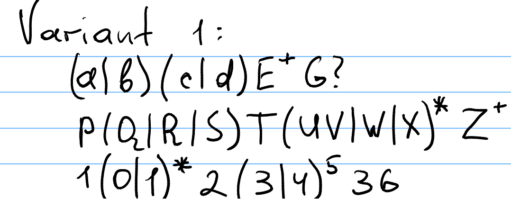
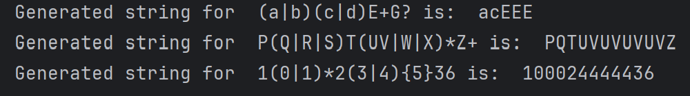
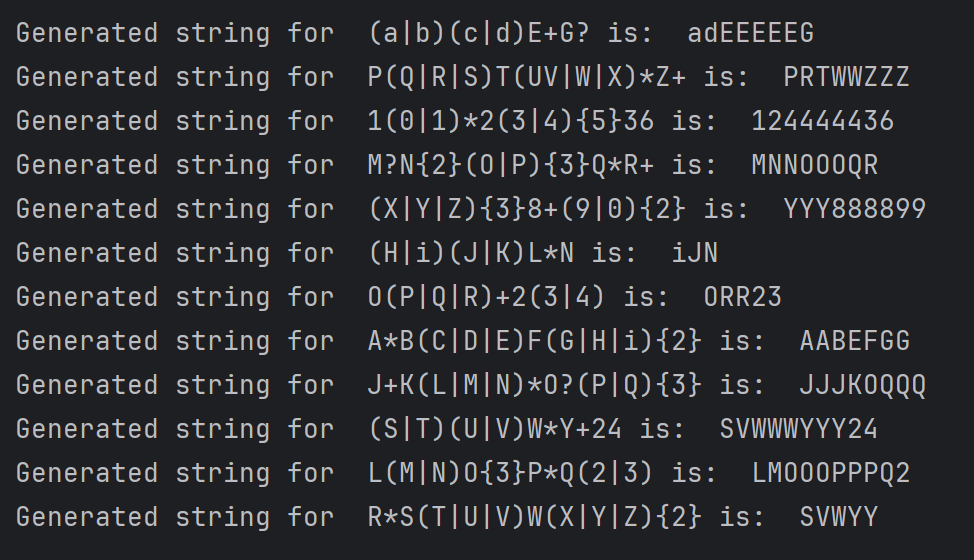

# Topic: Regular expressions


### Course: Formal Languages & Finite Automata
### Author: Anastasia Țîganescu, FAF-231
### Variant: 1

----

# Theory
Regular expressions (regex) are patterns used to match sequences 
of characters in a string. They help in searching, validating,
and manipulating text efficiently. Commonly used in programming
and data processing, regex can define rules like checking if an
email is valid, extracting phone numbers, or parsing structured
text.

In this lab, regex patterns were used dynamically to generate
valid strings. Instead of hardcoding outputs, the implementation
interpreted any given regex and produced matching strings, 
handling symbols like `*, +, ?, {}` (quantifiers), and `|` (alternation).
Parentheses were used for grouping, and processing followed a 
structured approach to ensure correctness.

# Objectives:

* Write and cover what regular expressions are, what they are used for;

* Below you will find 3 complex regular expressions per each variant. Take a variant depending on your number in the list of students and do the following:

* * Write a code that will generate valid combinations of symbols conform given regular expressions (examples will be shown). Be careful that idea is to interpret the given regular expressions dinamycally, not to hardcode the way it will generate valid strings. You give a set of regexes as input and get valid word as an output

* * In case you have an example, where symbol may be written undefined number of times, take a limit of 5 times (to evade generation of extremely long combinations);

* * Bonus point: write a function that will show sequence of processing regular expression (like, what you do first, second and so on)

* Write a good report covering all performed actions and faced difficulties..

# Implementation description
The implementation consists of two primary functions:

## 1. Tokenizing the Regular Expression
The function `divide(pattern)` splits the regex pattern into individual tokens (symbols, operators, and groups).
The `re.findall()` function is used to extract: parentheses(`()`), operators (` |, *, +, ?, {} `) and alphanumeric characters (words, letters, digits).
```
def divide(pattern):
    tokens = re.findall(r'\(|\)|\||\*|\+|\?|\{.*?\}|\w+', pattern)
    return tokens

```
## 2. Generating Strings Based on Tokens

The function `generate_string(tokens)` generates a string based on the list of obtained tokens.

If the token is a letter or digit (or a group of letters/digits), it's added to result as-is.
```
def generate_string(tokens):
    result = ""
    i = 0

    while i<len(tokens):
        if tokens[i].isalnum():
            result += tokens[i]
            i += 1
  
```

If the following token is a left paranthesis, then it starts working recursively
on the token group defined by those parantheses: 
```
  elif tokens[i] == "(": ## get the block of parantheses
            substring = []
            start = i
            j = start + 1

            while j < len(tokens) and tokens[j] != ")":
                substring.append(tokens[j])
                j += 1
            result1 = generate_string(substring)
            i = j + 1

            if i < len(tokens) and (tokens[i] in {"*", "+", "?"} or tokens[i].startswith("{")):
                result += repeat(result1, tokens[i])
                i += 1
            else:
                result += result1
```
Moreover, if the paranthesized group is followed by a quantifier, the function
`repeat(string, symbol)` is called to apply the appropriate repetition rule.
Otherwise, the result of the parenthesized group is simply appended.

If the identified token is the alternation, it collects possible options (either a single character or a group in parentheses)
and uses `choice(options)` to randomly select one.  
```
 elif tokens[i] == "|":
            options = [result]
            if tokens[i+1] == "(":
                substring = []
                start = i
                j = start + 1
                while j < len(tokens) and tokens[j] != ")":
                    substring.append(tokens[j])
                    j += 1
                options.append(generate_string(substring))
            else:
                options.append(tokens[i+1])
            result = choice(options)
            i += 2
```
Finally, if a quantifier (`*, +, ?, {}`) follows a character, it calls the function `repeat(string, symbol)`
to apply the appropriate repetition rule for the character appended most recently.

```
        elif tokens[i] in {"*", "+", "?"} or tokens[i].startswith("{"):
            last = result[-1]
            result = result[:-1] + repeat(last, tokens[i])
            i += 1
```
In the end, the function returns the fully generated string that matches the regex pattern.

The `repeat(string, symbol)` function is a helper function that applies regex quantifiers to a given string. It determines how many times the input string should be repeated based on the symbol (quantifier).
It takes two arguments: 
* string: The input string to be repeated.
* symbol: The quantifier (e.g., *, +, ?, {}).
```
def repeat(string, symbol):
    match symbol:
        case "*":
            return string * randint(0, 5)
        case "+":
            return string * randint(1, 5)
        case "?":
            return string * randint(0,1)
        case _:
            if symbol.startswith("{"):
                times = int(symbol[1:-1])
                return string * times
```
* The `*` quantifier means zero or more repetitions. 
Uses randint(0, 5) to generate a random number of repetitions between 0 and 5.
* The `+` quantifier means one or more repetitions.
Uses randint(1, 5), ensuring at least one occurrence.
* The `?` quantifier means zero or one occurrence.
Uses randint(0, 1), so the string appears once or not at all.
* If the quantifier is in curly braces (`{n}`), it means an exact number of repetitions.
It extracts `n` using `int(symbol[1:-1])` and repeats string exactly `n` times.


## Results
My Variant was 1, so I ran the string generator on all three regex patterns from the variant:





However, I also implemented unit testing to see the outputs for all patterns in all variants:



## Conclusions
This lab deepened my understanding of regular expressions and their role in text processing. I learned how to tokenize regex patterns, handle various operators dynamically, and generate valid strings accordingly. A key takeaway was recognizing how different quantifiers influence string generation and ensuring correct handling of alternation and grouping.

Additionally, testing was crucial in verifying the correctness of the implementation across multiple patterns. Writing structured unit tests reinforced the importance of debugging and refining the logic for broader applicability. Overall, this experience improved my skills in working with regex and applying it programmatically.
## References
* [Python, re.findall()](https://www.codecademy.com/resources/docs/python/regex/findall)
* [Python String isalnum()](https://www.w3schools.com/python/ref_string_isalnum.asp)
