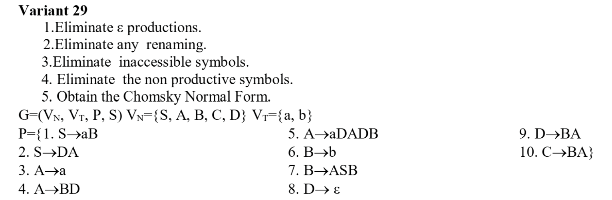
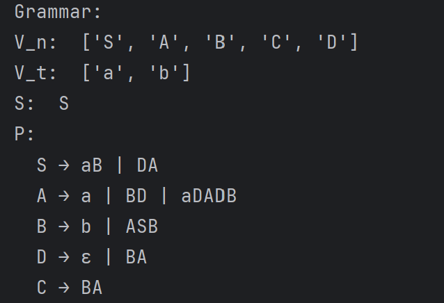
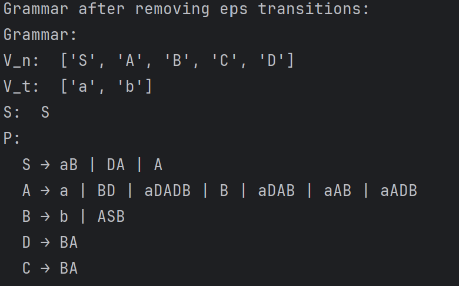
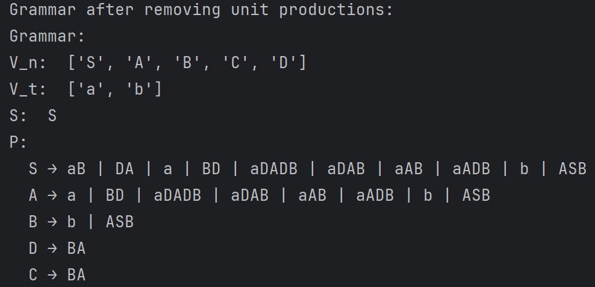
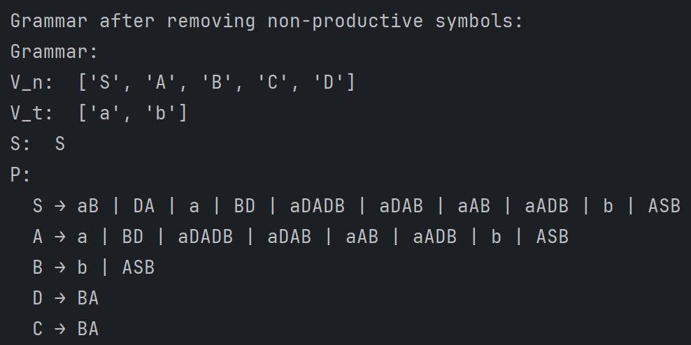
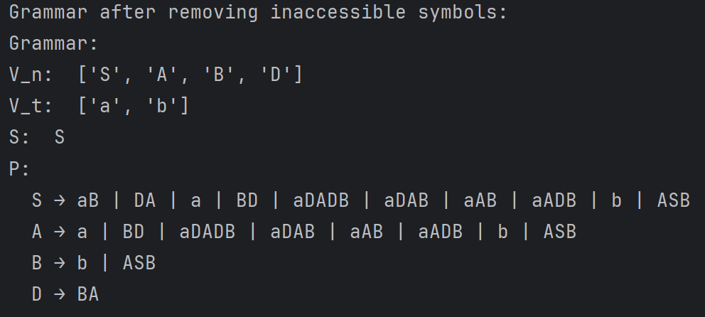
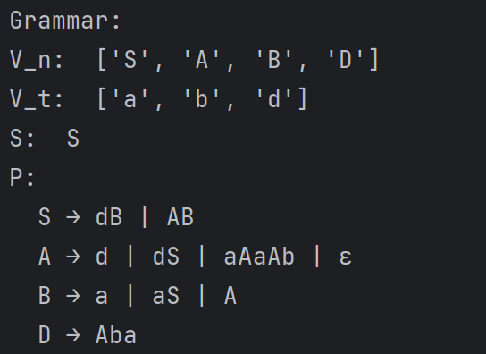
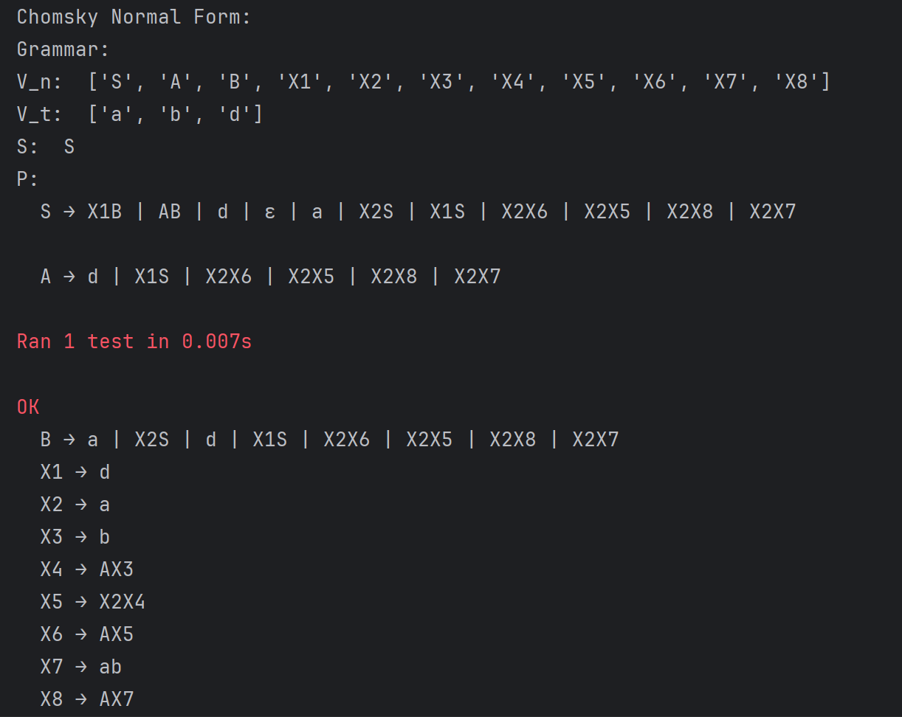

# Topic: Chomsky Normal Form


### Course: Formal Languages & Finite Automata
### Author: Anastasia Țîganescu, FAF-231
### Variant: 29

----

# Theory

Chomsky Normal Form (CNF) is a way of simplifying context-free grammars (CFGs). A grammar defines how strings (or words) are formed from a set of symbols. CNF is a special form of grammar where all rules follow these two patterns:

* A rule that produces two non-terminal symbols (like A → BC).
* A rule that produces a single terminal symbol (like A → a).

The goal of this lab was to convert a CFG into CNF, which makes it easier to process by computers. This is important in areas like compilers and natural language processing, where we need to understand how languages (like programming languages or human languages) are structured.

# Objectives:
* Learn about Chomsky Normal Form (CNF).
* Get familiar with the approaches of normalizing a grammar.
* Implement a method for normalizing an input grammar by the rules of CNF.
  * The implementation needs to be encapsulated in a method with an appropriate signature (also ideally in an appropriate class/type).
  * The implemented functionality needs executed and tested.
  * Also, another BONUS point would be given if the student will make the aforementioned function to accept any grammar, not only the one from the student's variant

# Implementation description
The CNF transformation involves several steps that 
simplify a context-free grammar (CFG) while preserving the 
language it generates. Each step is encapsulated in a method 
within the CNFConverter class, which processes the grammar in a
modular and systematic way.

The grammar is structured as an object with:

* V_n: List of non-terminal symbols.

* V_t: List of terminal symbols.

* P: Dictionary of productions, where each key is a non-terminal and the value is a list of productions.

* S: The starting symbol.

## Class CNFConverter
This class encapsulates all transformation methods necessary 
to convert a CFG into Chomsky Normal Form. Each method mutates 
the grammar step-by-step and returns it in a cleaner,
CNF-compliant form.

### Step 1. Remove ε-productions (null productions)
This step removes all productions of the form A → ε (where ε is the empty string, 
and A is a non-terminal), except possibly when S → ε is needed to preserve the language.

I implemented functions ```eliminate_eps_transitions(self, grammar)``` and a 
helper function ```get_indexes(word, eps)```.

In the function ```eliminate_eps_transitions(self, grammar)```, firstly a deep copy 
of the current production rules is made to avoid in-place modifications while iterating. This new set (new_P)
will store updated productions without ε-transitions.

A flag ```exist_nullables``` is used to determine whether nullable non-terminals remain. This loop continues until no
new ε-productions are discovered and processed.

```
    def eliminate_eps_transitions(self, grammar):
        new_P = {key: values[:] for key, values in grammar.P.items()}

        exist_nullables = True
```

Within each iteration, the function scans the production rules to identify 
all non-terminal symbols that directly derive ε (i.e., A → ""), excluding 
the start symbol S. These are recorded in a temporary list N.

```
        while exist_nullables:
            N = []
            exist_nullables = False
            for key, values in grammar.P.items():
                for value in values:
                   if value == "" and key != "S":
                       N.append(key)
                       exist_nullables = True

            if not N:
                # if "" in new_P[grammar.S]:
                #     grammar.V_n.append("S0")
                #     new_P["S0"] = [f"{grammar.S}"]
                #     grammar.S = "S0"
                break
```
For each nullable non-terminal found, the function
modifies all production rules that contain it on the right-hand
side. The goal is to generate all possible combinations of the
production with subsets of the nullable symbol omitted, preserving 
all derivable strings that do not require ε.

It uses the helper function ```get_indexes(word, eps)``` to find all positions where the 
nullable symbol appears in a right-hand side.
```
            for nullable in N:
                for key, values in grammar.P.items():
                    for value in values:
                        if value.count(nullable) > 0:
                            indexes = self.get_indexes(value, nullable)
                            new_prod = set()
```
Using ```combinations()``` from the ```itertools``` module, it generates every possible 
subset of those positions.

Each resulting string is constructed by removing the symbol at 
the specified positions, then rejoining the string.

These new variations are added to new_P, as long as they are not
duplicates of existing rules.
```
                            for i in range(1, len(indexes) + 1):
                                combos = combinations(indexes, i)
                                for combo in combos:
                                    chars = list(value)
                                    for index in combo:
                                        chars[index] = ''
                                    new = ''.join(chars)
                                    if new not in grammar.P[key]:
                                        new_prod.add(new)
                            new_prod = list(new_prod)
                            for elem in new_prod:
                                new_P[key].append(elem)
```
After generating all alternate forms, the ε-production itself (A → "") is removed from the updated set.
The grammar’s production dictionary P is updated at the end of each outer loop iteration to reflect the changes.
Once no further nullable symbols are found and handled, the updated grammar is returned.
```
            new_P[nullable].remove("")
            exist_nullables = True
            grammar.P = {key: values[:] for key, values in new_P.items()}

        grammar.P = new_P

        return grammar


```
The helper function ```get_indexes()``` returns the indexes of nullable symbols within 
a right-hand side — this is used to generate combinations of omitted symbols.

```
    def get_indexes(self, word, eps):
        indexes = []
        i = word.find(eps)
        while i != -1:
            indexes.append(i)
            i = word.find(eps, i + 1)
        return indexes

```


### Step 2: Eliminating Renaming (Unit) Transitions
This step removes unit productions, which are rules of the form A → B, where both A and B are non-terminals. These do not contribute meaningful 
derivations on their own and violate CNF structure.

I implemented function ```eliminate_renaming(self, grammar)```.

First, a deep copy of the current production set P is made into new_P. This will store the 
updated set of rules as unit productions are resolved.A flag ```exist_unit_productions``` is used to
check whether any unit productions remain in the grammar. The loop continues executing until all 
unit productions have been eliminated

```
      def eliminate_renaming(self, grammar):

        new_P = {key: values[:] for key, values in grammar.P.items()}

        exist_unit_productions = True

        while exist_unit_productions:
        
```
Then, for each production rule A → B, where B is a single non-terminal, the 
function identifies it as a unit production. It then appends all the rules of B
(i.e., B → α) into A, effectively replacing A → B with A → α.
This is done without adding B itself again, thus progressively eliminating unit productions from the grammar.

```
            while exist_unit_productions:
            exist_unit_productions = False
            for key, values in grammar.P.items():
                for value in values:
                    if len(value) == 1 and value in grammar.V_n:
                        new = grammar.P[value]
                        for elem in new:
                            if elem not in new_P[key]:
                                new_P[key].append(elem)
                        new_P[key].remove(value)
                        exist_unit_productions = True
```
 After one complete pass of checking and updating, the grammar’s productions are overwritten with the updated new_P.
Once no unit productions are left (i.e., the loop ends), the updated grammar object is returned.

```
            grammar.P = {key: values[:] for key, values in new_P.items()}

        return grammar

```

### Step 3: Eliminating Nonproductive Symbols
This transformation step ensures that only productive non-terminals — those
that can eventually lead to strings composed solely of terminals — are kept in the grammar. Any nonproductive symbols, which can never derive a 
terminal string, are removed from both the set of non-terminals and the production rules.

I implemented functions ```eliminate_nonprod(self, grammar)``` and a 
helper function ```find_nonproductive_symbols(self, grammar)```.

In the function ```eliminate_nonprod(self, grammar)```, it first calls the helper function.
This helper function identifies all nonproductive non-terminals.
```
        nonproductive_symbols = self.find_nonproductive_symbols(grammar)
        new_P = {key: values[:] for key, values in grammar.P.items()}
```
If the list is non-empty, the function removes each nonproductive non-terminal
from the list of variables (grammar.V_n) Then, it removes all productions associated
with that symbol.
Finally, it removes any rules from other productions where the right-hand side contains a nonproductive symbol.

```
        if len(nonproductive_symbols) > 0:
            for symbol in nonproductive_symbols:
                grammar.V_n.remove(symbol)
                new_P.pop(symbol) #remove productions from those nonprods
                for key, values in new_P.items():
                    for value in values:
                        if symbol in value:
                            values.remove(value)
            grammar.P = new_P

        return grammar
```
The ```find_nonproductive_symbols(self, grammar)``` function 
performs the core logic for discovering nonproductive symbols.

It maintains a list productive_symbols to keep track of non-terminals that can generate terminal strings.
It loops through each production rule and checks whether the right-hand side of a rule contains only terminals or 
productive symbols.
If yes, the left-hand side non-terminal is added to the list.
This is repeated until no new productive symbols are found.

```
           def find_nonproductive_symbols(self, grammar):
        productive_symbols = []
        for key, values in grammar.P.items():
            if key in productive_symbols:
                continue
            for value in values:
                if all(char in grammar.V_t or char in productive_symbols for char in value):
                    if key not in productive_symbols:
                        productive_symbols.append(key)
                        break
```
Finally, all non-terminals that do not appear in the productive list are marked as nonproductive and returned.
```
        nonprod = []
        for nonterminal in grammar.V_n:
            if nonterminal not in productive_symbols:
                nonprod.append(nonterminal)
        return nonprod

```


### Step 4: Eliminating Inaccessible Symbols
This transformation step removes inaccessible non-terminals — those that
can never be reached from the start symbol through any sequence of production rules.

I implemented functions ```eliminate_inaccessible(self, grammar)``` and a 
helper function ```find_inaccessible_symbols(self, grammar)```.

The function ```eliminate_inaccessible(self, grammar)```starts by calling
the helper functon ```find_inaccessible_symbols(self, grammar)``` which 
computes all the non-terminal symbols that cannot be reached from the start symbol S.

```
        new_P = {key: values[:] for key, values in grammar.P.items()}
        inaccessible_symbols = self.find_inaccessible_symbols(grammar)
```
If there are any inaccessible symbols they are removed from the list of non-terminals (V_n),
their production rules are deleted and any rules in which they
appear on the right-hand side are removed as well, since they are unreachable.
```
        if len(inaccessible_symbols) > 0:
            for symbol in inaccessible_symbols:
                grammar.V_n.remove(symbol)
                new_P.pop(symbol)
                for key, values in new_P.items():
                    for value in values:
                        if symbol in value:
                            values.remove(value)
            grammar.P = new_P

        return grammar
```
The function ```find_inaccessible_symbols(self, grammar)``` finds all non-terminal symbols that are not accessible from the start symbol.

First, it initializes the list of accessible symbols with the start symbol only:

```
    def find_inaccessible_symbols(self, grammar):
        accessible_symbols = [grammar.S]
        inaccessible_symbols = []
```
Then, for each production's right-hand side, it adds all symbols that are not yet in the accessible list.
```
        for key, values in grammar.P.items():
            for value in values:
                for elem in value:
                    if elem not in accessible_symbols:
                        accessible_symbols.append(elem)
```
Finally, it compares the list of accessible symbols against all non-terminals. Any non-terminal not found in the accessible list is labeled as inaccessible.
```
        for nonterminal in grammar.V_n:
            if nonterminal not in accessible_symbols:
                inaccessible_symbols.append(nonterminal)
        return inaccessible_symbols

```

### Step 5: Obtaining Chomsky Normal Form (CNF)

Chomsky Normal Form requires all productions in a context-free grammar to follow these forms:

* A → BC (where B and C are non-terminal symbols)

* A → a (where a is a terminal symbol)

* (Optionally: S → ε if the empty string is in the language)

This step ensures that every production in the grammar matches those rules.


I implemented functions ```obtain_chomsky(self, grammar)``` and a 
helper function ```break_into_binary(self, grammar, value, new_P, counter, new_nonterminals, terminal_to_var)```.

The function ```obtain_chomsky(self, grammar)``` drives the process of converting the grammar into CNF.
    
Initially, a copy of the current grammar's production rules (grammar.P) is created to avoid modifying the original grammar while working with it. 
Then, a counter is initialized for unique variable names. The counter list holds a single integer, initialized to 1. 
It is used for generating unique variable names like X1, X2, etc., which will be necessary for introducing new non-terminals to replace terminals.

```   
    def obtain_chomsky(self, grammar):

        new_P = {key: values[:] for key, values in grammar.P.items()}
        counter = [1]
``` 
The list new_nonterminals holds the set of non-terminal symbols from the grammar, and will be updated as new non-terminals are added during the process.
The terminal_to_var is a dictionary that maps each terminal symbol to a newly created non-terminal variable (like X1, X2, etc.). 
``` 
        new_nonterminals = grammar.V_n
        terminal_to_var = {}
``` 
For each production in the grammar (grammar.P), the function iterates through the values of each rule.
If the value has more than one symbol (i.e., len(value) > 1), it calls the ```break_into_binary``` function to convert it into valid CNF.
Once all transformations are done, the grammar’s productions (grammar.P) and non-terminals (grammar.V_n) are updated with the modified versions.
``` 
        for key,values in grammar.P.items():
            for i, value in enumerate(values):
                value = list(value)

                if len(value) > 1:
                    new_P[key][i] = self.break_into_binary(grammar, value, new_P, counter, new_nonterminals, terminal_to_var)

        grammar.P = new_P
        grammar.V_n = new_nonterminals
        return grammar

```
The helper function handles the core logic for breaking down 
production rules into valid binary forms and replacing terminals
with new variables.

First, it checks if the production is already binary.
If the value already has exactly 2 symbols, it checks if both symbols are non-terminals (grammar.V_n).
If the condition is satisfied, the rule is already in CNF and can be returned as is.

``` 
    def break_into_binary(self, grammar, value, new_P, counter, new_nonterminals, terminal_to_var):

        if len(value) == 2:
            if all(elem in grammar.V_n for elem in value):
                return ''.join(value)
```

However, if the value contains a mix of terminals and non-terminals, or both are terminals, the function ensures 
that each terminal is replaced by a newly introduced non-terminal.
For each terminal in value, if it doesn't already have a corresponding non-terminal in terminal_to_var, it creates
a new variable (e.g., X1, X2), adds it to the new_P productions, and updates the terminal_to_var mapping.

After replacing terminals with non-terminals, the updated value is returned.
``` 
            else:
                for i, elem in enumerate(value):
                    if elem in grammar.V_t:
                        if elem not in terminal_to_var.keys():
                            var = f"X{counter[0]}"
                            counter[0] += 1
                            terminal_to_var[elem] = var
                            new_P[var] = [elem]
                            new_nonterminals.append(var)
                        value[i] = terminal_to_var[elem]
                return ''.join(value)
``` 
If the value has more than two symbols, the function recursively splits the production.
First, it handles the first symbol in the value (first). If it is a terminal, it introduces a new non-terminal (e.g., X3).
It then recursively calls ``` break_into_binary```  to handle the remaining part of the value (rest).
Once the rest is broken down, it links the parts together to ensure all productions are binary.

After the entire value is processed, it returns the transformed production in CNF.

``` 

        first= value[0]
        rest = value[1:]

        if first in grammar.V_t:
            if first not in terminal_to_var.keys():
                v = f"X{counter[0]}"
                counter[0] += 1
                terminal_to_var[first] = v
                new_P[v] = [first]
                new_nonterminals.append(v)
            first = terminal_to_var[first]

        var = self.break_into_binary(grammar, rest, new_P, counter, new_nonterminals, terminal_to_var)

        if var not in terminal_to_var.keys():
            v = f"X{counter[0]}"
            counter[0] += 1
            terminal_to_var[var] = v
            new_P[v] = [var]
            new_nonterminals.append(v)
        rest = terminal_to_var[var]
        return ''.join(first + rest)

``` 

## Results
My Variant was 29. The output displays the grammar after each step, up until it becomes a CNF.










However, I also implemented unit testing to see the outputs for two more variants, to test if the converter works with any other CFG.





## Conclusions
In this project, I successfully implemented a process to convert a context-free grammar (CFG) into Chomsky Normal Form (CNF). The main goal was to understand and apply the necessary steps for transforming a CFG while preserving the language it generates.

The key steps I followed in the CNF conversion process included:

* Eliminating ε-productions: I removed any productions that generate the empty string (ε), except for the start symbol when required.

* Eliminating unit productions: These are productions where a non-terminal symbol directly produces another non-terminal. I replaced such rules with equivalent productions that do not violate CNF rules.

* Eliminating nonproductive symbols: I identified non-terminal symbols that cannot derive terminal strings and removed them from the grammar.

* Eliminating inaccessible symbols: I removed non-terminal symbols that cannot be reached from the start symbol.

* Converting to CNF: Finally, I made sure all remaining productions followed the CNF rules, ensuring every production either produced two non-terminals or a single terminal.

By following these steps, the grammar was transformed into a simplified structure that is compatible with CNF. This process is essential for further tasks in computational linguistics, such as parsing, because CNF makes grammars easier to process algorithmically.

## References
* [Eliminating epsilon productions.](hhttps://www.tutorialspoint.com/explain-the-elimination-of-epsilon-productions-in-cfg)
* [Removing non-productive symbols.](https://www.tutorialspoint.com/automata_theory/removal_of_useless_symbols_in_cfg.htm)
* [Convert CFG to CNF](https://www.tutorialspoint.com/convert-the-given-context-free-grammar-to-cnf)

