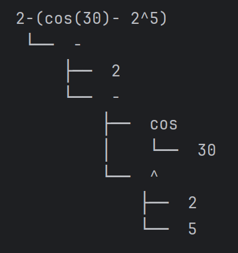
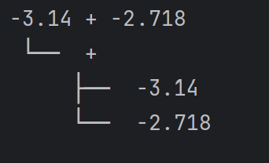
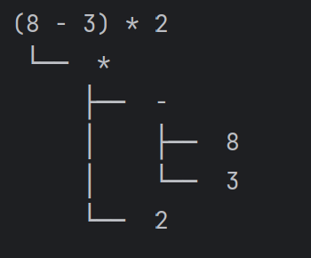

# Topic: Parser & Building an Abstract Syntax Tree


### Course: Formal Languages & Finite Automata
### Author: Anastasia Țîganescu, FAF-231

----

# Theory
Parsing is the process of analyzing a sequence of tokens (produced by a lexer) to determine its grammatical
structure according to a set of rules. It’s a key step in interpreting or compiling programming languages. 
The result of parsing is usually an Abstract Syntax Tree (AST), which is a structured, tree-like representation
of the input. Each node in the AST represents a part of the syntax: for example, numbers, operators like + or *,
or function calls like sin and cos.

In this lab, I implemented a simple parser using a technique called recursive descent parsing, where each 
function handles a specific part of the grammar based on operator precedence. Along with it, I built an AST
where I defined different node types such as Number for numeric values, Operation for binary operations, and
Function for mathematical functions. This makes it easier to evaluate or analyze expressions later. I also used 
regular expressions to classify tokens using a TokenType enum, which helps the lexer identify whether something is 
a number, operator, or function. 

# Objectives:

* Get familiar with parsing, what it is and how it can be programmed.
* Get familiar with the concept of AST.
* In addition to what has been done in the 3rd lab work do the following:
  * In case you didn't have a type that denotes the possible types of tokens you need to:
    * Have a type TokenType (like an enum) that can be used in the lexical analysis to categorize the tokens.
    * Please use regular expressions to identify the type of the token.
  * Implement the necessary data structures for an AST that could be used for the text you have processed in the 3rd lab work.
  * Implement a simple parser program that could extract the syntactic information from the input text.

# Implementation description
I implemented a parser class, AST nodes classes and a new lexer class, which differs from the one I created in the third laboratory.

## 1. Lexer Class
At the heart of the lexer lies the ```TokenType``` enum. Each member of this enum represents a different type of token that the 
language supports. I used Python’s ```Enum``` class to define token types in a structured and readable way. Each token type is 
associated with a regular expression pattern:
```
TOKENS = {
    "NUMBER" : r"[+-]?(\d+(\.\d+)?)",
    "ADD": r"\+" ,
    "SUB": r"\-" ,
    "MUL": r"\*" ,
    "COS": r"cos",
    "SIN": r"sin",
    "MOD": r"%",
    "DIV": r"\/",
    "LPAR": r"\(",
    "RPAR": r"\)",
    "PWR": r"\^",
    "WHITESPACE": r"\s+"
}
```

To tokenize the input efficiently, I build a master regular expression that can match any one of the token types.
This is done with a named group for each pattern:
```
TOKEN_REGEX = "|".join(f"(?P<{token.name}>{token.value})" for token in TokenType)

```

The re.compile() function is used to precompile this regex for better performance:

```
TOKEN_PATTERN = re.compile(TOKEN_REGEX)
```

The main tokenization function, ```tokenize(text)```  loops over the input text and finds all matches of the compiled pattern:
```
def tokenize(text):
    tokens = []
    for match in TOKEN_PATTERN.finditer(text):
        type = match.lastgroup
        value = match.group()
        if type != "WHITESPACE":
            tokens.append((TokenType[type], value))
    return tokens
```
The lexer is designed to ignore all whitespace, which simplifies parsing logic later on. This is done by assigning 
whitespace its own token type and simply skipping any matches of it inside the tokenize() function.


## 2. AST Nodes Class
The AST represents the structural, hierarchical form of an input expression after it has been 
tokenized and parsed. Each node in the AST corresponds to a syntactic construct (number, operation, or function), and the tree 
structure captures how these constructs are combined.

### Number Node
This node represents a numeric literal (integer or float) and appears as a leaf in the AST.
It has no children and encapsulates the most basic building block of an expression: a number.

```
class Number:
    def __init__(self, value):
        self.value = value
```

### Operation Node
This node represents a binary arithmetic operation (addition, subtraction, multiplication, division, power, modulo).
It is central to tree construction because expressions are recursive and usually involve operations.
```
class Operation:
    def __init__(self, left, op, right):
        self.left = left
        self.op = op
        self.right = right

```

### Function Node
This node represents a mathematical function application, like sin(expr) or cos(expr).
Function nodes are unary: they apply a transformation to a single subexpression. The argument can itself be complex.
```
class Function:
    def __init__(self, function, argument):
        self.function = function
        self.argument = argument
```

### Printing the AST
```print_ast(tree)``` is a recursive function used to print the Abstract Syntax Tree (AST) in a structured, visual format. 
It displays the hierarchy and structure of the AST nodes using tree-like indentation, making it easier to understand how 
expressions are parsed and grouped.

```
connector = "└── " if is_last else "├── "
```

This determines the visual connector used before the node's label.

* If the node is the last sibling, it uses `└──`, implying the end of a branch.
* Otherwise, it uses `├──`, indicating there are more siblings to come below.


```
if isinstance(node, Number):
    print(prefix, connector, node.value)
```
If the current node is a `Number` (a literal like `5`), it prints its numeric value. Since it's a leaf node, no recursion follows.

```
elif isinstance(node, Function):
    print(prefix, connector, node.function)
    print_ast(node.argument, prefix + ("    " if is_last else " │   "), True)
```
If the node is a `Function`, first, the function name (`sin`, `cos`) is printed. 
Then, the function's argument is printed recursively using `print_ast`. The `prefix` is updated based on whether this
node is the last sibling. If it is, it adds spaces to avoid drawing vertical lines down. Otherwise, it adds `" │   "` to draw a continuation line for other siblings.

The function argument is always considered the last child, since a function only takes one argument in this design.


```
elif isinstance(node, Operation):
    print(prefix, connector, node.op)
    print_ast(node.left, prefix + ("    " if is_last else " │   "), False)
    print_ast(node.right, prefix + ("    " if is_last else " │   "), True)
```
If the node is a `Operation`, the operator (`+`, `*`, `^`, etc.) is printed first. 
Then, both left and right child nodes (operands) are printed recursively. 
The left child is not the last (hence `False`), and the right child is always considered the last (`True`), because there are only two children, and we want the tree to close cleanly.


## 3. Parser Class
The Parser class is responsible for converting a list of tokens into an Abstract Syntax Tree (AST). It uses recursive descent
parsing, where each grammar rule has a corresponding function.

When an instance of the parser is initialized, it is initialized with a list that will hold the tokens to parse, which is initially empty,
and an integer index to track the current position in the token list.

This design allows the parser to be reused: tokens can be "fed" to it later via feed().
```
 def __init__(self):
        self.tokens = []
        self.pos = 0

```
### a. The ```feed(tokens)``` function
The ```feed(tokens)``` method is used to assign a token list to the parser after it has been created. This method is useful for 
testing multiple inputs with the same parser instance, avoiding the need to recreate it each time.
```
 def feed(self, tokens):
        self.tokens = tokens
        self.pos = 0
```

### b. The ```current_token()``` function

It returns the current token at position self.pos, or None if the position is beyond the end of the token list.
This acts as a safe way to peek at the next token without advancing the position.
```
    def current_token(self):
        return self.tokens[self.pos] if self.pos < len(self.tokens) else None

```
### c. The ```current(type)``` function
It checks whether the current token matches the expected token type. It retrieves the current token and compares its type (token[0]) with
the one provided as argument.
This is used in parse_expr() and other methods to decide which rule to apply next.
It returns True if the token matches, False otherwise.
```
    def current(self, type):
        token = self.current_token()
        return token and token[0] == type

```
### d. The ```advance(self)``` function

It moves the parser forward by one token. It returns the current token and then increments self.pos.
This is how the parser consumes tokens once they’ve been recognized and processed.
```
     def advance(self):
        token = self.current_token()
        self.pos += 1
        return token
```
### e. The ```parse_expr()``` function

The parser follows standard operator precedence:
* Addition/Subtraction (+, -) - lowest precedence
* Multiplication/Division/Power (*, /, ^)
* Unary Functions or Parentheses or Numbers - highest precedence

The ```parse_expr()``` function parses expressions involving addition and subtraction. It sits at the top level of the 
precedence hierarchy, meaning it recognizes the full expression and defers more tightly-bound operations (like multiplication)
to other functions.

```
 def parse_expr(self):
        node = self.parse_term()
```
This calls parse_term(), which handles the next level down in precedence (multiplication, division, power).
The result is stored in node, which will be built upon if additional + or - operations are found.

```
        while self.current(TokenType.ADD) or self.current(TokenType.SUB):
            op = self.advance()[1]
            right = self.parse_term()
            node = Operation(node, op, right)
        return node
```
This loop checks whether the current token is either + or -. If it is, then more of the expression must be parsed.
Once a + or - token is detected, this line consumes it using advance(), moving the parser forward.
After consuming the operator, it expects and parses the right-hand side of the operation, which must be another term.
This could be a number, a function call, or a grouped expression.
A new Operation AST node is created, representing the binary operation.
The current node becomes the left operand, right is the right operand, and op is the operator.
This assignment means that node is updated on each loop iteration, effectively chaining multiple additions/subtractions left-to-right.

### e. The ```parse_term()``` function
The `parse_term()` function is responsible for parsing multiplicative expressions, which include multiplication (*), division (/), and exponentiation (^). 
These operations are higher in precedence than addition and subtraction, so `parse_term()` is typically called from within `parse_expr()`, which handles lower-precedence operations.

The function begins by calling `parse_factor()` and storing its result in the variable node. This
means that every term starts with a factor—usually a number, a function (like cos(x)), or a parenthesized expression. 
The idea is to consume the leftmost operand before looking for any chained operations.

```
  def parse_term(self):
        node = self.parse_factor()
```
Next comes a `while` loop that checks whether the current token is a multiplication, division, or power operator. 
If such an operator is found, the parser consumes it with `advance()`, extracts the operator string, and then parses the factor 
that follows on the right-hand side. An Operation node is then constructed with the current node as the left operand, the newly 
parsed factor as the right operand, and the operator as the operation type.

```
        while self.current(TokenType.MUL) or  self.current(TokenType.DIV) or  self.current(TokenType.PWR):
            op = self.advance()[1]
            right = self.parse_factor()
            node = Operation(node, op, right)
        return node
```

This updated Operation node becomes the new value of node, allowing for left-to-right chaining of multiple multiplicative or 
exponential operations.
Once there are no more multiplicative or power operators ahead, the loop exits and the function returns the final node, which may represent a 
simple factor or a more complex tree of nested operations.

### f. The ```parse_factor()``` function
The `parse_factor()` function is responsible for parsing the most atomic components of an expression—called factors—which can 
be numbers, function calls (like cos or sin), or grouped subexpressions enclosed in parentheses.

It begins by retrieving the current token using `current_token()`. This token is then examined to determine what kind of factor
is being processed.

```
     def parse_factor(self):
        token = self.current_token()
```

If the token is a NUMBER, the parser advances (i.e., moves the cursor forward), and wraps the number's value in a Number AST node. 
This node is returned immediately, as a number is a complete factor on its own.
```
        if token[0] == TokenType.NUMBER:
            self.advance()
            node = Number(token[1])
            return node
```

If the token is a function identifier—either COS or SIN—then the parser processes a function call. It first advances to 
consume the function name and stores the function string (e.g., cos). It advances again to skip the opening parenthesis or 
any delimiter, assuming the syntax is something like `cos(…)`. Then it recursively calls `parse_expr()` to parse the argument 
inside the function. After the argument, it advances once more to consume the closing parenthesis. Finally, it wraps the function 
name and the parsed argument in a Function AST node and returns it.

```
  elif token[0] == TokenType.COS or token[0] ==  TokenType.SIN:
            func = self.advance()[1]
            self.advance()
            argument = self.parse_expr()
            self.advance()
            node = Function(func, argument)
            return node
```

If the token is a left parenthesis (LPAR), then a subexpression is being parsed. The parser advances to skip the opening parenthesis, 
then recursively calls `parse_expr()` to parse the entire inner expression. After that, it advances once more to skip 
the closing parenthesis (RPAR). The parsed inner expression is returned directly, effectively treating the whole parenthetical
as a single factor.
```
        elif token[0] == TokenType.LPAR:
            self.advance()
            expr = self.parse_expr()
            self.advance() ##ending RPAR
            return expr
```

## Results & Screenshots
To ensure the correctness and reliability of the parser, I implemented a set 
of unit tests using the unittest framework. These tests cover a variety of mathematical 
expressions to verify that the lexer correctly tokenizes and parses different types of input.
After parsing, each AST is printed.

```
class Teser(unittest.TestCase):
    def test1(self):
        tokens = []
        parser = Parser()

        # test = "cos(0.9) + sin(30) - 5"
        # test = "8 - 3 * 2"
        # test = "(3^4 + 5) / 2"
        # test = "cos(30)"
        # test = "-3.14 + +2.718"
        # test = "2.00 + 5"
        # test = "cos(30 + sin(45) * 2) / 5"
        test = "2-(cos(30)- 2^5)"

        parser.feed(tokenize(test))
        tree = parser.parse_expr()
        print_ast(tree)
```
Some example of outputs:






## Conclusions
Through this lab, I learned how to build a basic parser and connect it with both a lexer and an abstract syntax tree (AST).
I understood how the parsing process works in multiple stages, where expressions are broken down into terms and factors, 
respecting operator precedence. Writing the parse_expr, parse_term, and parse_factor functions helped me see how recursive
descent parsing works in practice.

I also improved my understanding of how to represent expressions as tree structures using AST nodes like Number, Operation, 
and Function. Visualizing the parsed tree with print_ast made it easier to debug and understand the structure of the input.

Compared to my earlier lexer from lab 3, I learned how to write a cleaner and more flexible version using regular expressions 
and enums. This made the tokens easier to manage and extend in the future.

Overall, I feel more confident in breaking down and analyzing expressions using code. I also learned how important clean 
structure and modular design are when connecting components like the lexer, parser, and AST.

## References
* [How to construct an AST](https://stackoverflow.com/questions/1721553/how-to-construct-an-abstract-syntax-tree)
* [Abstract Syntax Tree](https://en.wikipedia.org/wiki/Abstract_syntax_tree)
* [Enum](https://docs.python.org/3/library/enum.html)